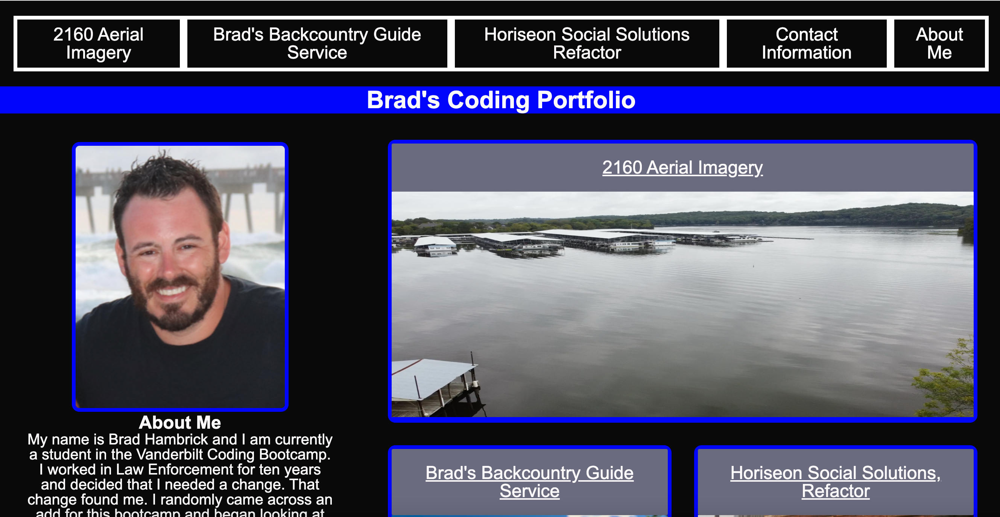
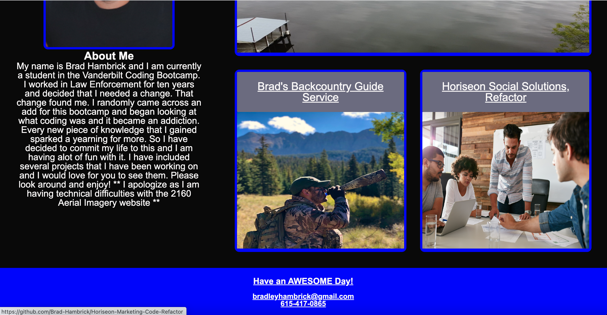
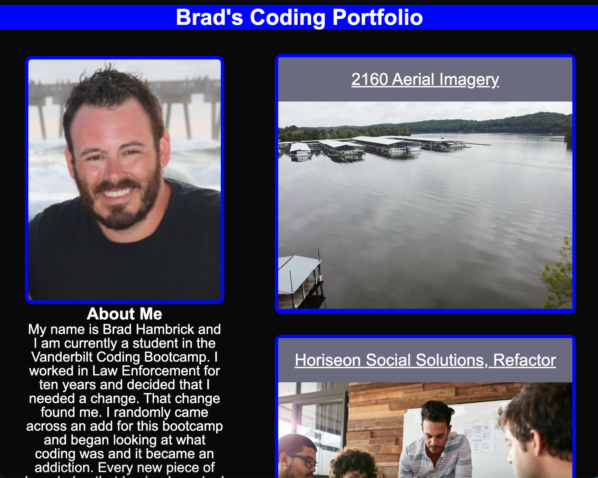
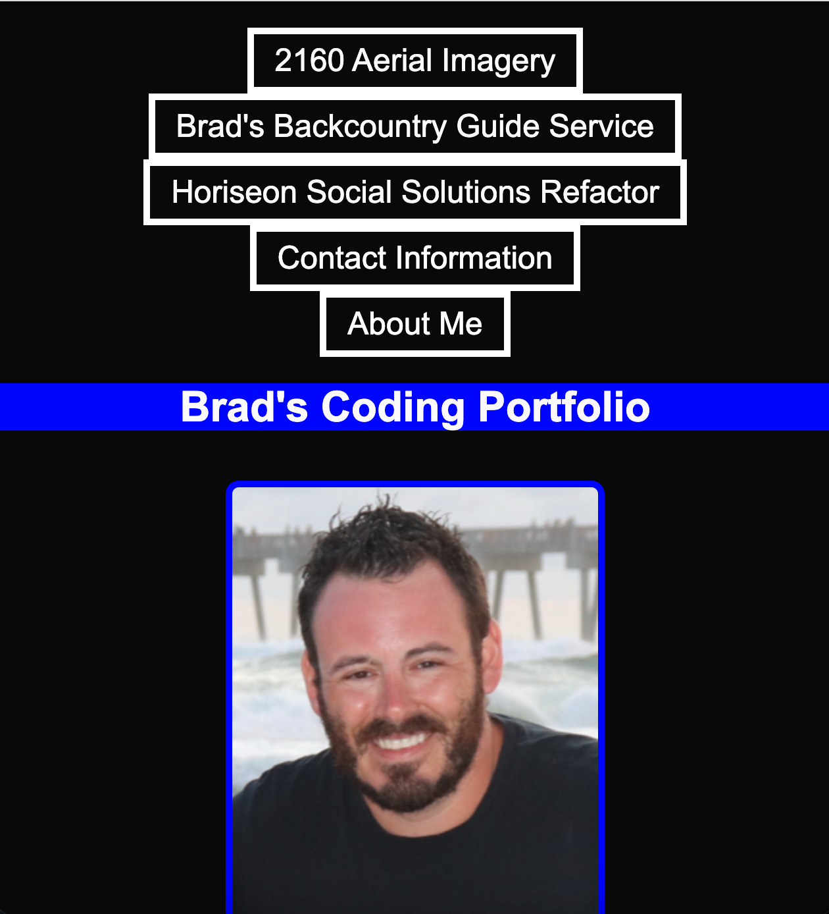

# Brad's Coding Portfolio

## Deployed Application
[Brad's Coding Portfolio](https://brad-hambrick.github.io/Portfolio-Project/)

## Description
This project was completed in order to showcase coding projects that were completed by Brad Hambrick in order to give potential employers a means of viewing his work and a way to contact him. 

## Badges
2160 Aerial Imagery and Brad's Backcountry Guide service were applications originally created by Brad Hambrick and all images were personally taken by him.  The Horiseon Marketing Project was a code refactor and the link to the GitHub page will display the changes made to the webpage in order to make the code cleaner and more accessible.  All of the images/licensing requirements in the Horiseon project were completed and provided by Horiseon Marketing.  

## Visuals

## Usage
This project will be used in order to showcase completed coding projects in order to assist with future job applications for Brad Hambrick.

## Support
For support, contact Brad Hambrick @bradleyhambrick@gmail.com

## Roadmap
As Brad Hambrick grows in his coding career, additional projects will be added to showcase his work.  He also plans to add features to make the site more interactive when additional knowledge is obtained using javascript.

## Contributing
This project is open to recommendations and future contributions.

## Authors and acknowledgment
Thanks to Vanderbilt Coding Bootcamp for contributing to the knowledge required to build this project.

## License
All images and licensing were obtained by Horiseon Social Solutions or are not required as they are original products of Brad Hambrick.

## Project status
The project is completed to a point of being operational, however additional features may be added in the future.  
